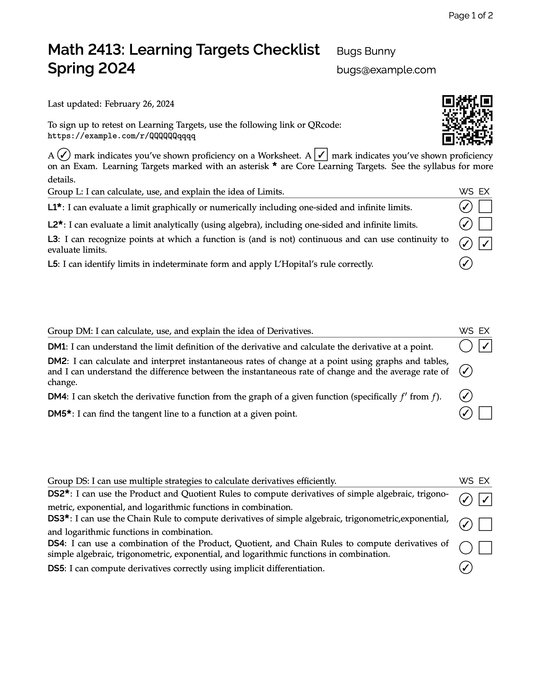
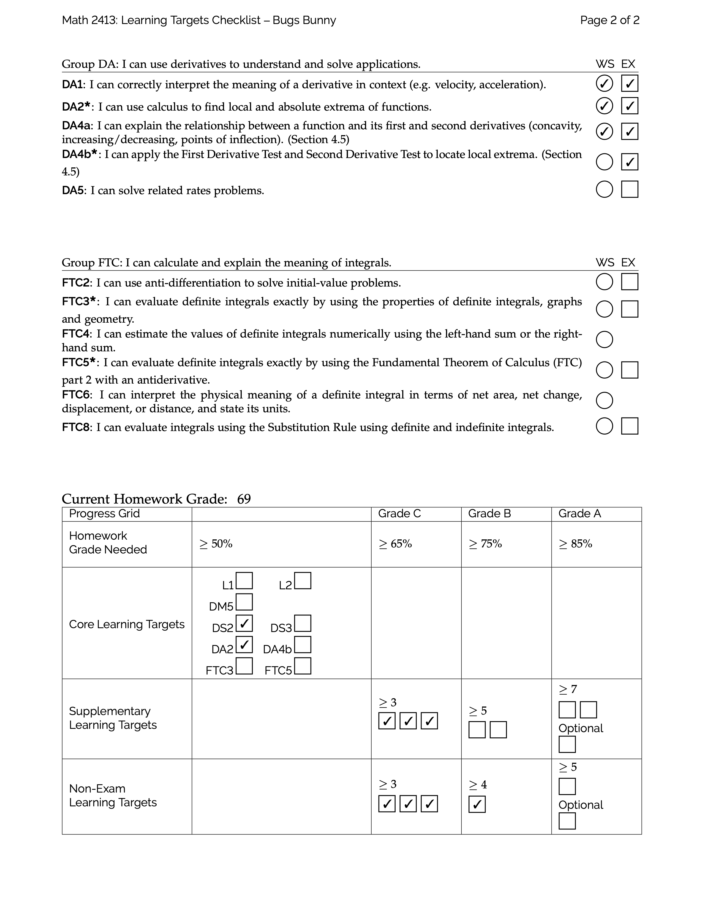

# Learning Targets Progress Tracker

These files generate a PDF checklist of Learning Targets and a Progress Grid updated from a Blackboard gradebook for all students.

The main logic is written in the R Programming Language and is in the file "all_students.Rtex".  

To generate the PDF on Overleaf

0. Upload this project to Overleaf.
1. Go to your Blackboard course shell and go to download your grades.  Under "OPTIONS" on the download page, select "Comma" as the Delimiter Type.  Download the grades.
2. Make sure the file extension is ".csv".  If not, go back to step 1 and choose the right options.
3. After downloading the gradebook file, rename the file to "gb.csv".
4. On Overleaf, click on the "Upload" icon.  This icon is right above the list of files.
5. Upload the file "gb.csv" file.  This will replace a file already there.
6. Click the green "Recompile" button.

A possible issue may arise from how you name the WeBWorK homework column in the gradebook.  The code will search for the column with the text "WeBWorK" and rename the corresponding column to "hw_grade".  If there is an error when the code is searching for this column, then either change the text to search for in the file "all_students.Rtex" or rename the column in the gradebook file.

